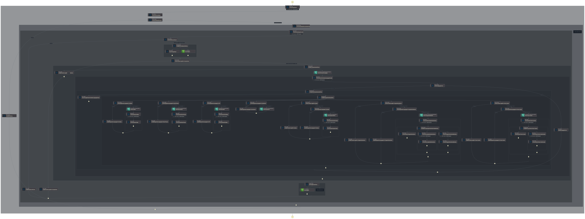

# AWS Comprehend 💻📚


## Overview
The AWS Comprehend project provides a serverless, event-driven architecture for analyzing user-submitted text using the powerful natural language processing capabilities of AWS Comprehend. It exposes the processed data through a normalized data lake, empowering users to derive valuable insights from their textual data. With this system, users can effortlessly submit blocks of text, which are securely stored in Amazon S3, leveraging its scalability and durability. The real magic happens when AWS Comprehend, a sophisticated machine learning service, performs a comprehensive suite of natural language processing tasks on the text, extracting insights and enriching the data.

# Usage
AWSComprehend is a project built with Amazon Web Services (AWS) that leverages various AWS services, including Amazon Comprehend, for natural language processing tasks. It uses Terraform, an infrastructure as code (IaC) tool, to manage the creation and integration of AWS resources.

## Prerequisites
To use this project, you need to have the following prerequisites set up:

1. **AWS Account**: Create an Amazon Web Services account if you don't have one already.
2. **Terraform Installation**: Download and install Terraform according to your system requirements. Terraform is an open-source tool that allows you to define and provision infrastructure resources using code.
3. **AWS Credentials Configuration**: Configure your AWS credentials by following the AWS/Terraform requirements. This typically involves setting up an AWS Access Key and Secret Access Key, which will allow Terraform to interact with your AWS account.

## Installation
Once your development environment is configured with the prerequisites, you can deploy the project with the following steps:

**Clone the Repository**

Download the repository to your desired location by running the following command:
```bash
git clone https://github.com/lindsaygelle/AWSComprehend.git
```

**Navigate to the Project Directory**

Change your current directory to the newly downloaded repository.
```bash
cd AWSComprehend
```

**Initialize Terraform**

Initialize Terraform by running the following command, which will download the necessary provider plugins:
```bash
terraform init
```

**Review the Infrastructure Plan**

Review the infrastructure changes that Terraform will make by executing the following command:
```bash
terraform plan
```
This will show you a preview of the resources that will be created, updated, or deleted.

**Apply the Infrastructure Changes**

Once you have reviewed the plan and are ready to apply the changes, run the following command:
```bash
terraform apply
```

This will prompt you to confirm the changes before proceeding with the deployment. Type yes to confirm and start the deployment process.

After the deployment is complete, you should have the necessary AWS resources provisioned, including Amazon Comprehend and any other services required by the project.

# Comprehend Pipeline 🚚
This project is a serverless data processing pipeline built on AWS using Terraform. It performs natural language processing and analysis on text files uploaded to an S3 bucket, exposing various insights provided by the AWS Comprehend API.

## Overview
The pipeline consists of the following components:

1. **S3 Bucket**: A designated S3 bucket with a `/text/` partition for storing the input text files, providing a secure and scalable repository for user submissions.
2. **S3 Notification**: When a new file is uploaded to the `/text/` partition, an S3 notification is triggered, initiating the text analysis journey.
3. **SQS Queue**: The S3 notification sends a message to an SQS queue, ensuring efficient and reliable message delivery.
4. **Step Function (Comprehend)**: The SQS queue triggers the first Step Function, orchestrating the initial text processing workflow.
5. **AWS Comprehend**: The Step Function invokes AWS Comprehend, leveraging its advanced natural language processing capabilities to extract valuable insights from the text. This includes language detection, entity recognition, key phrase extraction, personally identifiable information (PII) detection, sentiment analysis, syntax analysis, targeted sentiment analysis, and toxic content detection.
6. **S3 Output**: The analysis results are securely stored in an S3 bucket under the `/comprehend/` partition, ensuring easy access and retrieval.
7. **S3 Notification**: When a new file is written to the `/comprehend/` partition, another S3 notification is triggered, initiating the next phase of the pipeline.
8. **SQS Queue**: The S3 notification sends a message to a second SQS queue, facilitating seamless communication between pipeline stages.
9. **Step Function (Datalake)**: The second SQS queue triggers the second Step Function, responsible for organizing and partitioning the Comprehend analysis results.
10. **S3 Output**: The partitioned data is stored in the S3 bucket under the `/datalake/comprehend` partition, creating a structured and accessible data lake for further analysis and exploration.

## State Machines
Below is an explaination of the state machines that perform the main work of the orchestration.

### S3ObjectCreatedText


1. **Retrieve Notification**: It retrieves a notification from SQS, which is routed via AWS EventBridge, indicating that a new file has been uploaded to the S3 bucket.
2. **Retrieve File**: It fetches the uploaded file from the specified location in the S3 bucket.
3. **Detect Language**: It utilizes AWS Comprehend to detect the language of the document, determining its primary language.
4. **Text Analysis**: It fans out using all available AWS Comprehend endpoints (excluding medical) to perform various text analysis tasks on the document. These tasks may include entity recognition, key phrase extraction, sentiment analysis, syntax analysis, and toxic content detection.
5. **Normalize Data**: It normalizes the data obtained from each Comprehend endpoint, ensuring consistency and uniformity in the format of the analysis results.
6. **Combine Data**: It combines the original event data with the analyzed data from AWS Comprehend, creating a comprehensive dataset containing both the original document information and the insights extracted from it.
7. **Store in S3**: It stores the combined data in the designated "comprehend" folder within the same S3 bucket, making it easily accessible for further analysis or retrieval.


### S3ObjectCreatedComprehend


1. **Receive Notification**: It receives a notification indicating the availability of a new Comprehend document, which was created by the previous state machine.
2. **Retrieve Document**: It retrieves the newly created Comprehend document from the specified location in the S3 bucket.
3. **Explode Records**: It breaks down the Comprehend records into individual data types, such as entities, key phrases, sentiment analysis, etc.
4. **Normalize Keys**: It normalizes the keys within each record, ensuring consistency and uniformity in the naming conventions.
5. **Write Data to S3**: It writes the exploded and normalized data into logical partitions in the S3 bucket. The data is organized by data model, language, and relevant attributes of the data model itself, facilitating efficient storage and retrieval.

# AWS Resources 🏗
The following AWS resources are utilized in this project:

<table>
  <thead>
    <tr>
      <th>AWS Resource</th>
      <th>Description</th>
    </tr>
  </thead>
  <tbody>
    <tr>
      <td><a href="https://docs.aws.amazon.com/s3" target="_blank">S3</a></td>
      <td>Object storage service for storing input text files and processed data.</td>
    </tr>
    <tr>
      <td><a href="https://docs.aws.amazon.com/s3" target="_blank">SQS</a></td>
      <td>Fully managed message queuing service for reliable communication between components.</td>
    </tr>
    <tr>
      <td><a href="https://docs.aws.amazon.com/s3" target="_blank">Step Functions</a></td>
      <td>Serverless orchestration service for coordinating the various steps in the pipeline.</td>
    </tr>
    <tr>
      <td><a href="https://docs.aws.amazon.com/s3" target="_blank">Comprehend</a></td>
      <td>Natural language processing service for analyzing text data and extracting insights.</td>
    </tr>
    <tr>
      <td><a href="https://docs.aws.amazon.com/s3" target="_blank">Glue</a></td>
      <td>Fully managed extract, transform, and load (ETL) service for preparing and loading data.</td>
    </tr>
    <tr>
      <td><a href="https://docs.aws.amazon.com/eventbridge/" target="_blank">EventBridge</a></td>
      <td>Continuous data movement service for efficiently transferring data between AWS services.</td>
    </tr>
  </tbody>
</table>

# Contributing 🤝
Contributions to this [AWS Comprehend](https://www.github.com/lindsaygelle/AWSComprehend) are welcome! We appreciate any contributions,
whether they are bug reports, feature requests, documentation improvements, or code enhancements.

## Reporting Issues
If you encounter any bugs or have feature requests, please open a new issue on the GitHub repository. When reporting an issue, please provide as much detail as possible,
including steps to reproduce the problem, expected behavior, and any relevant logs or error messages.

## Contributing Code
If you would like to contribute code changes, please follow these _basic steps_:

- Fork the repository on GitHub.
- Create a new branch for your changes.
- Make your changes and commit them with descriptive commit messages.
- Push your changes to your forked repository.
- Create a pull request in the main repository, describing your changes in detail.

Please ensure that your code adheres to the project's [coding standards and conventions](./CONTRIBUTING.md). Additionally, make sure to include tests for any new functionality or bug fixes.

## Guidelines
Before starting any major contribution, please open an issue first to discuss your ideas and ensure they align with the project's goals and direction.
This will help prevent duplicate effort and ensure that your contributions are more likely to be accepted.

Please refer to the [CONTRIBUTING.md](./CONTRIBUTING.md) file for more detailed guidelines on contributing to this project.

We appreciate your contributions and look forward to working together to make this [AWS Comprehend](https://www.github.com/lindsaygelle/AWSComprehend) project even better!

## Improvements 🛠️
While the current implementation provides a solid foundation for text processing using AWS Comprehend, there are several areas where enhancements could be made:

- **Optimized S3 Partitioning**: Consider revising the partitioning strategy for storing Comprehend analysis results in S3. This could involve consolidating smaller files to reduce storage costs and improve retrieval efficiency.
- **Streamlined State Machines**: Explore opportunities to streamline and optimize the orchestration of pipeline components by consolidating or simplifying the existing state machines.
- **Text Chunking for Large Files**: Modify the text processing workflow to handle large input files more efficiently by chunking them into smaller segments. This approach can improve processing speed and resource utilization, especially for lengthy documents.
- **Enhanced Error Handling**: Implement robust error handling mechanisms within the state machines to gracefully manage exceptions and failures during text processing. This can enhance the reliability and resilience of the pipeline, ensuring smooth operation under various conditions.
- **Language Translation with AWS Polly**: Extend the pipeline's functionality by integrating AWS Polly to translate text files that are not in the target language. This enhancement can broaden the scope of supported languages and make the pipeline more versatile for diverse text inputs.
- **Data Lake Security**: Enhance security measures for the data lake by implementing access controls, encryption, and monitoring mechanisms. This includes restricting access to sensitive data, encrypting data at rest and in transit, and setting up alerts for unauthorized access attempts or suspicious activities.

These potential improvements aim to enhance the performance, scalability, and reliability of the AWS Comprehend pipeline, providing a more robust solution for text analysis tasks.

# License 📄
[AWSComprehend](https://www.github.com/lindsaygelle/AWSComprehend) is licensed under the [MIT License](https://en.wikipedia.org/wiki/MIT_License). Feel free to use, modify, and distribute the code within this repository as per the terms of the license.

Please see the [LICENSE](./LICENSE) file for more details.
